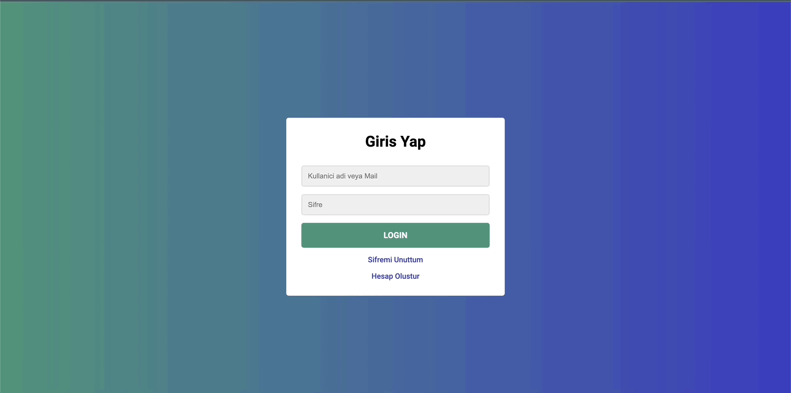

<h1>JavaScript Login Page</h1>

A small project of a login page.

<h2>Techniques used for this project</h2>

Filled it up with HTML, styled it with custom CSS properties with "var()" to use shortcuts repeated values. Also scripted it with JavaScript.

<h2> Screen gif of final result</h2>

